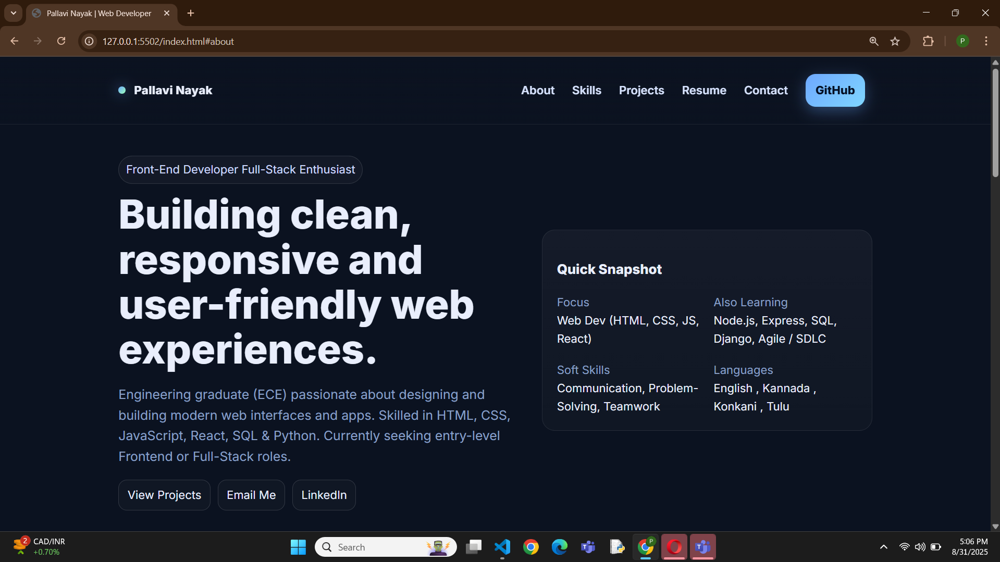
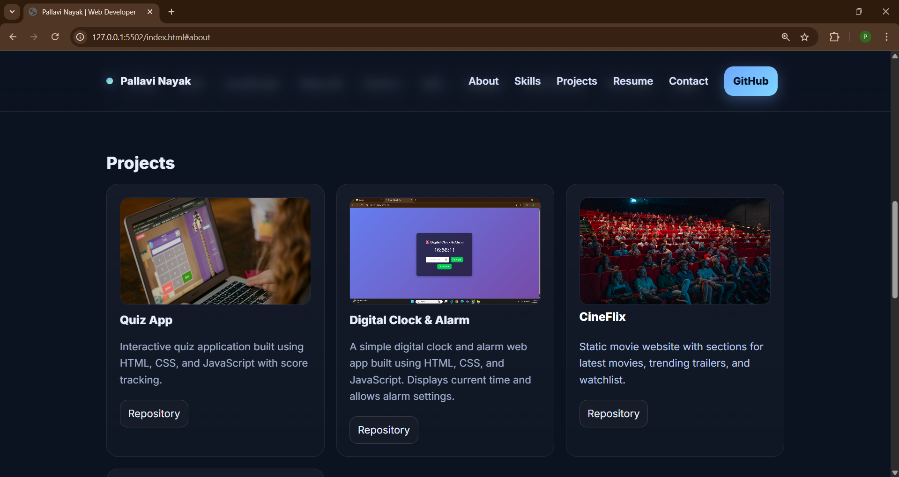
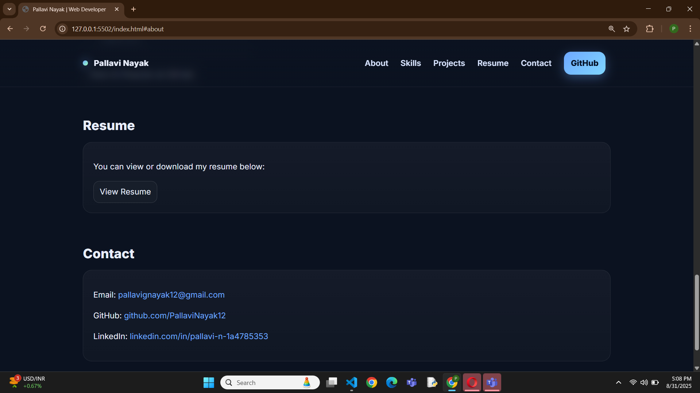

# 🌐 Portfolio Website

A responsive personal portfolio website built using **HTML, CSS, and JavaScript** to showcase my skills, projects, resume, and contact details.

--- 
## 🚀 Features 
- Clean and responsive design  
- Smooth navigation bar with sections (About, Skills, Projects, Resume, Contact)                       
- Project showcase with links to GitHub repositories   
- Resume preview & download option 
- Contact section with quick access to email and LinkedIn   
---
## 📸 Preview

### 🏠 Homepage                  

### 💻 Projects Section

### 🧩 Extra Project

### 📄 Resume & 📬 Contact

---

## 🛠️ Tech Stack
- **Frontend:** HTML5, CSS3, JavaScript 
- **Tools:** VS Code 
